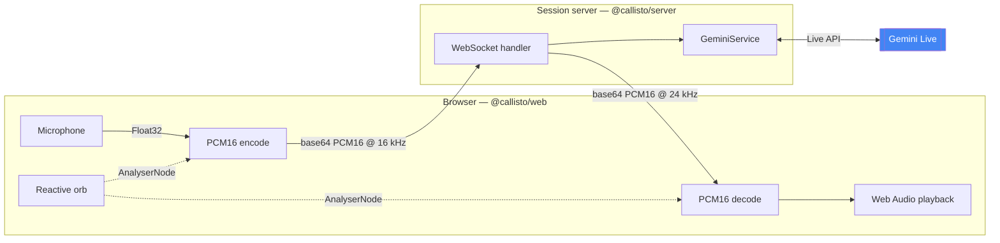
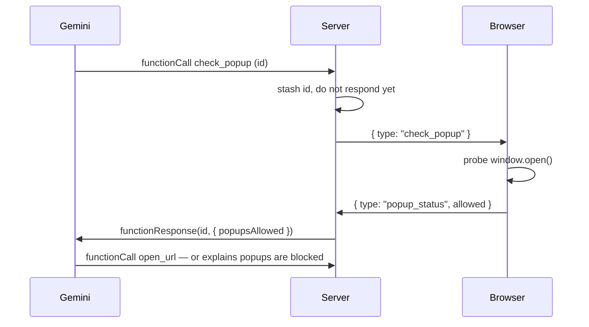

# Callisto

**A real-time voice assistant you talk to, not type at.** Speak, and Callisto
answers in natural speech with sub-second latency — interrupting her mid-sentence
works the way it does with a person.

[](https://github.com/nelay04/Callisto/actions/workflows/ci.yml)
[](LICENSE)
[](https://www.typescriptlang.org/)

<!-- TODO: replace with a recorded GIF of the orb reacting to speech.
     This is the single highest-impact thing missing from this README. -->

---

## What makes it interesting

Most "AI voice assistants" are speech-to-text → LLM → text-to-speech, with a
second or two of latency at each hop. Callisto streams **raw audio in both
directions** over a single WebSocket to the Gemini Live API, so there is no
transcription round-trip in the critical path — the model hears audio and emits
audio.

That design choice drives everything else in this repo:

- **Barge-in works.** Speaking over Callisto stops her playback immediately,
  because the microphone stream never pauses.
- **The orb is driven by the actual signal.** Volume and a spectral-centroid
  pitch proxy are sampled from both audio graphs at 20 Hz and fed into the
  visualisation — it reacts to *what is being said*, not to a timer.
- **Tools round-trip through the browser.** The model can open a profile link
  or draft an email, and one tool (`check_popup`) suspends the model's turn
  until the browser answers. See [Tool calling](#tool-calling).

## Architecture



**Why a server at all,** when the browser could call Gemini directly? Because
the API key would then be in the browser. The session server exists to hold the
credential, gate who may open a session, and keep tool execution server-side.

The wire format between the two halves lives in one place —
[`packages/protocol`](packages/protocol/src/index.ts) — so the client and server
cannot drift apart without a compile error.

## Repository layout

```
callisto/
├── apps/
│   ├── server/          Express + WebSocket bridge to Gemini Live
│   └── web/             Next.js 15 client with the reactive orb
└── packages/
    └── protocol/        Shared WebSocket message types + validators
```

| Workspace | Stack |
|---|---|
| [`@callisto/server`](apps/server) | Node 22, Express 4, `ws`, `@google/genai` |
| [`@callisto/web`](apps/web) | Next.js 15, React 19, Tailwind 4, Motion |
| [`@callisto/protocol`](packages/protocol) | Zero-dependency TypeScript |

## Quickstart

**Prerequisites:** Node 22+ and a [Gemini API key](https://aistudio.google.com/apikey).

```bash
git clone https://github.com/nelay04/Callisto.git
cd Callisto
npm install

cp apps/server/.env.example apps/server/.env         # add your GEMINI_API_KEY
cp apps/web/.env.local.example apps/web/.env.local

npm run dev
```

Open <http://localhost:3000>, allow microphone access, and start talking.

<details>
<summary>Running with Docker instead</summary>

```bash
cp apps/server/.env.example apps/server/.env         # add your GEMINI_API_KEY
docker compose up --build
```

Both images build from the repo root, since npm workspaces hoist
`node_modules` above the individual apps.
</details>

### Configuration

`apps/server/.env`:

| Variable | Required | Default | Purpose |
|---|---|---|---|
| `GEMINI_API_KEY` | ✅ | — | Gemini API credential |
| `MAILTO_ADDRESS` | ✅ | — | Where the `send_mailto` tool addresses drafts |
| `GEMINI_MODEL` | | `gemini-2.5-flash-native-audio-preview-12-2025` | Must support the Live API with native audio |
| `PORT` | | `3001` | |
| `CORS_ORIGIN` | | `http://localhost:3000` | Comma-separated; also gates WebSocket upgrades |
| `MAX_SESSIONS_PER_IP` | | `3` | Concurrent sessions allowed per client IP |
| `LINKEDIN_URL` / `GITHUB_URL` | | — | Targets for the `open_url` tool |

`apps/web/.env.local`:

| Variable | Default | Purpose |
|---|---|---|
| `NEXT_PUBLIC_WS_URL` | `ws://localhost:3001/ws/session` | Session socket |
| `NEXT_PUBLIC_API_URL` | `http://localhost:3001` | REST base URL |

These are inlined at build time — a Docker image must be **rebuilt**, not just
restarted, to point at a different backend.

## Tool calling

Callisto exposes three functions to the model, defined in
[`apps/server/src/tools/`](apps/server/src/tools):

| Tool | Effect |
|---|---|
| `open_url` | Opens a configured profile (`linkedin`, `github`) in a new tab |
| `send_mailto` | Opens the user's mail client with a drafted message **to the owner** |
| `check_popup` | Asks the browser whether popups are currently allowed |

`check_popup` is the one worth reading the code for. Everything else resolves
server-side and returns immediately, but only the browser knows whether
`window.open()` will be blocked — so the server sends the question to the client
and **holds the model's tool call open** until the answer arrives:



Without this, a blocked popup is invisible to the model and it cheerfully claims
to have opened a link that never appeared.

## Development

```bash
npm run dev         # both apps, with hot reload
npm run typecheck   # tsc --noEmit across all workspaces
npm run lint        # ESLint
npm test            # Vitest
npm run build       # production build of all three workspaces
```

Tests cover the pure logic where a silent bug would be hardest to spot by hand:
the PCM16 encode/decode round-trip, transcript-turn merging, protocol
validation, and WebSocket admission control. Audio playback and the Gemini
session itself are verified by hand — see [CONTRIBUTING.md](CONTRIBUTING.md).

## Limitations

Stated plainly, because this is a portfolio project rather than a product:

- **No user authentication.** Access control is an origin check plus a
  per-IP session cap. That is enough to stop a stranger's web page from
  draining the Gemini quota; it is not enough for a paid service.
- **In-memory state.** Session counts live in a `Map`, so the per-IP cap is
  per-instance and resets on restart. Running more than one replica needs a
  shared store.
- **No conversation persistence.** Transcripts exist only in browser state.
- **`ScriptProcessorNode` is deprecated.** It is used for microphone capture
  because it is universally supported; `AudioWorklet` is the modern
  replacement and the natural next change.
- **Gemini Live is a preview API.** Model names and config shapes move.

## Making it yours

Callisto's persona is deliberately specific — she's named for both Jupiter's
outermost Galilean moon and the Greek huntress, and she introduces herself as
a portfolio companion. To repurpose the project, edit
[`apps/server/src/prompts/callisto.prompt.ts`](apps/server/src/prompts/callisto.prompt.ts)
and set your own `LINKEDIN_URL`, `GITHUB_URL`, and `MAILTO_ADDRESS`.

## License

[MIT](LICENSE) © Nelay Karmakar
