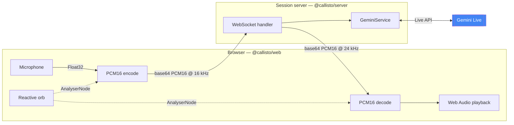
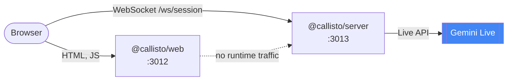
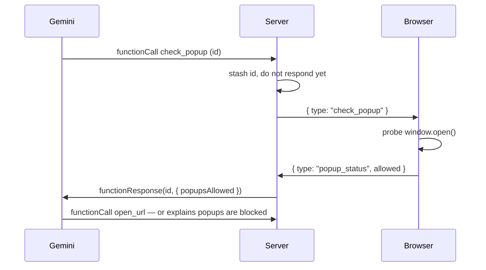

# Architecture

How Callisto is put together and why. For getting it running, see
[running.md](running.md); for what the knobs do, [configuration.md](configuration.md).

---

## The central design choice

Most "AI voice assistants" are speech-to-text → LLM → text-to-speech, with a
second or two of latency at each hop. Callisto streams **raw audio in both
directions** over a single WebSocket to the Gemini Live API, so there is no
transcription round-trip in the critical path — the model hears audio and emits
audio.

Three consequences follow, and they explain most of the code:

- **Barge-in works.** Speaking over Callisto stops her playback immediately,
  because the microphone stream never pauses.
- **The orb is driven by the actual signal.** Volume and a spectral-centroid
  pitch proxy are sampled from both audio graphs at 20 Hz and fed into the
  visualisation — it reacts to *what is being said*, not to a timer.
- **Tools round-trip through the browser.** The model can open a configured link
  or draft an email, and one tool (`check_popup`) suspends the model's turn
  until the browser answers. See [Tool calling](#tool-calling).

## Components

**Why a server at all,** when the browser could call Gemini directly? Because
the API key would then be in the browser. The session server exists to hold the
credential, gate who may open a session, and run tool calls server-side.

The wire format between the two halves lives in one place —
[`packages/protocol`](../../packages/protocol/src/index.ts) — so the client and
server cannot drift apart without a compile error.

| Workspace | Stack |
|---|---|
| [`@callisto/server`](../../apps/server) | Node 22, Express 4, `ws`, `@google/genai` |
| [`@callisto/web`](../../apps/web) | Next.js 15, React 19, Tailwind 4, Motion |
| [`@callisto/protocol`](../../packages/protocol) | Zero-dependency TypeScript |

## Who talks to whom

Worth stating plainly, because it drives the whole deployment story: **the web
container never calls the session server.** The only client the server ever has
is browser JavaScript — [`useVoiceAssistant.ts`](../../apps/web/src/hooks/useVoiceAssistant.ts)
opens the WebSocket from the page.

Two things follow:

1. There is **no container-to-container traffic**, so the two services need no
   shared network and no service-name DNS. The Podman stack takes advantage of
   this and uses rootless `pasta` networking with no bridge at all.
2. The session server **cannot be purely internal**. It does not need a public
   port of its own, but the browser has to reach it somehow — in production
   through the same reverse proxy that serves the web app. See
   [deployment.md](deployment.md).

## Audio pipeline

Capture runs at 16 kHz and playback at 24 kHz — two separate `AudioContext`s,
because those are the rates Gemini Live expects on each side. Incoming chunks
are scheduled back-to-back against `nextStartTime` so playback stays gapless,
and an `interrupted` message stops every scheduled source at once.

`ScriptProcessorNode` is used for microphone capture because it is universally
supported. It is deprecated; `AudioWorklet` is the modern replacement and the
natural next change.

### Who speaks first

Callisto does. A Live session that has received nothing produces nothing, so
the server sends `CALLISTO_GREETING` as a closed user turn the instant the
session opens, and the model answers into an empty room.

The send has to happen *after* `live.connect()` resolves rather than inside its
`onopen` callback — the SDK fires `onopen` just before resolving, while the
service's session handle is still null, so a turn sent there would be dropped
without an error. Both audio playback and the greeting depend on the browser's
`AudioContext` having been created inside the click that starts a session,
which is why the orb is a button rather than an autoplaying page.

## Tool calling

Callisto exposes four functions to the model, defined in
[`apps/server/src/tools/`](../../apps/server/src/tools):

| Tool | Effect |
|---|---|
| `open_url` | Opens one of the `CALLISTO_LINKS` destinations in a new tab |
| `send_mailto` | Opens the user's mail client with a drafted message **to the owner** |
| `check_popup` | Asks the browser whether popups are currently allowed |
| `scatter_orb` | Flings the orb's particles across the viewport and reassembles them |

`scatter_orb` is the odd one out: it changes nothing on the server and is
answered immediately, because making the model wait on a decorative animation
would only stall the conversation the animation decorates. The browser promotes
the orb's canvas to a full-viewport overlay for the ~2.7s it runs, keeping the
orb's screen position and radius identical so the promotion itself is invisible.
It is only offered when architecture disclosure is on. The description keeps it
to turns actually about the interface — an orb that scatters unprompted reads as
a rendering bug rather than a flourish — while explicitly allowing repeats on
request, and forbidding the model from announcing it first.

`open_url` is built per session rather than declared once. Its enum comes from
`CALLISTO_LINKS`, so the destinations the model may name are exactly the ones
configured — a link cannot be invented, and adding one is an `.env` edit. With
nothing configured the declaration is withheld entirely, rather than offering a
tool that can only fail.

`check_popup` is the one worth reading the code for. Everything else resolves
server-side and returns immediately, but only the browser knows whether
`window.open()` will be blocked — so the server sends the question to the client
and **holds the model's tool call open** until the answer arrives:

Without this, a blocked popup is invisible to the model and it cheerfully claims
to have opened a link that never appeared.

## She can explain herself

`CALLISTO_EXPLAIN_ARCHITECTURE` appends a briefing to the system instruction
that authorises Callisto to describe her own construction, crediting
`CALLISTO_BUILDER_NAME`. Off by default.

The interesting part is that the boundary is drawn in the briefing rather than
left to the model's judgement. The repository is public and MIT-licensed, so its
design is public — the streaming decision, the tools, the deferred `check_popup`
turn, the shape of the monorepo. What is *not* public is the deployment: the
briefing names credentials, configuration values, hosts, domains, ports,
containers, paths and logs as things she declines, and tells her to decline once
and warmly rather than argue. It also tells her to admit ignorance instead of
guessing, since being caught inventing detail about herself would defeat the
purpose.

See [configuration.md](configuration.md#explaining-herself).

## Admission control

The server is a public endpoint holding a metered credential, so two gates sit
in front of every session, both in [`ws/gate.ts`](../../apps/server/src/ws/gate.ts):

- **Origin allow-list** — `CORS_ORIGIN` gates CORS *and* WebSocket upgrades. An
  origin that is not listed gets a 403 before a socket is established.
- **Per-IP session cap** — `MAX_SESSIONS_PER_IP` bounds concurrent sessions from
  one caller, since each one bills against the Gemini quota. Behind a proxy the
  client IP is taken from `X-Forwarded-For`, so the proxy must set it or every
  session will appear to come from one address.

## The persona is configuration, not code

`CALLISTO_SYSTEM_PROMPT` lives in `apps/server/.env`, and
[`callisto.prompt.ts`](../../apps/server/src/prompts/callisto.prompt.ts) only
loads and normalises it. Retuning the persona needs no recompile and no image
rebuild.

The loader exists because the two `.env` readers disagree about escapes:
Compose's `env_file` parser resolves `\"` into `"` before the value reaches the
process, and dotenv — used by `npm run dev` — does not. Both resolve `\n`.
Normalising on read is what keeps `npm run dev` and the containers loading a
byte-identical prompt from the same file; without it they would silently
diverge. It is covered by
[`callisto.prompt.test.ts`](../../apps/server/src/prompts/callisto.prompt.test.ts),
and CI asserts the prompt still survives Compose's parser.

It is read lazily rather than at import time, so a missing prompt fails the one
session that needs it — with an actionable message — instead of taking down
every module that transitively imports the Gemini config.

## Limitations

Stated plainly, because this is a portfolio project rather than a product:

- **No user authentication.** Access control is an origin check plus a
  per-IP session cap. That is enough to stop a stranger's web page from
  draining the Gemini quota; it is not enough for a paid service.
- **In-memory state.** Session counts live in a `Map`, so the per-IP cap is
  per-instance and resets on restart. Running more than one replica needs a
  shared store.
- **No conversation persistence.** Transcripts exist only in browser state.
- **`ScriptProcessorNode` is deprecated.** See [Audio pipeline](#audio-pipeline).
- **Gemini Live is a preview API.** Model names and config shapes move.
- **A missing `GEMINI_API_KEY` crashes the process on the first upgrade**, since
  the config getter throws inside the WebSocket upgrade handler. Set the key.
