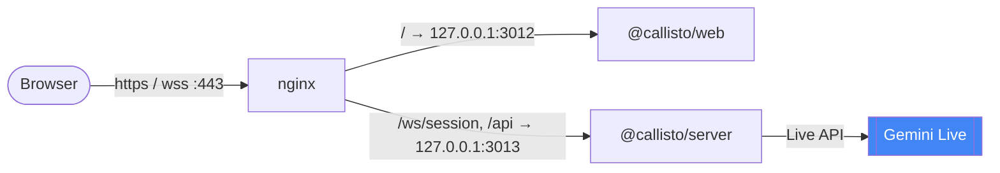

# Deployment behind nginx

Putting Callisto on a domain, on a host that is already running other things.

---

## Does the backend need to be exposed?

**It does not need a public port of its own — but it cannot be internal-only
either.** Both halves go behind one nginx server block, on one domain.

The reason is that the session server's only client is *browser JavaScript*.
[`useVoiceAssistant.ts`](../../apps/web/src/hooks/useVoiceAssistant.ts) opens the
WebSocket from the page, so the address in `NEXT_PUBLIC_WS_URL` must be
reachable from the visitor's browser. The web container never calls the server
itself, so no amount of container networking can hide it.

What that buys you, done this way:

- Only nginx listens publicly. Both containers stay on `127.0.0.1`.
- The socket is **same-origin** with the page — `wss://your-domain/ws/session` —
  so `CORS_ORIGIN` is one value and there is no cross-origin handshake.
- TLS terminates once, in nginx. The containers speak plain HTTP on loopback.



> If you instead run nginx *inside* the compose project, you can drop both
> `ports:` mappings and let nginx reach the services by name — but then the
> Podman stack needs a bridge network, so remove `network_mode: pasta` from
> both services. With nginx already on the host serving other projects,
> loopback publishing is the simpler fit.

---

## nginx server block

`/ws/session` must come before `/`, and needs the upgrade headers and a long
read timeout — a voice session is long-lived and can be quiet for minutes, so
nginx's 60-second default would drop it mid-conversation.

```nginx
# Once, at http{} level — maps the Upgrade header for proxied WebSockets.
map $http_upgrade $connection_upgrade {
    default upgrade;
    ''      close;
}

server {
    listen 443 ssl;
    # `http2 on;` needs nginx >= 1.25.1. On older builds it fails the config
    # test with `unknown directive "http2"` — drop this line and write the
    # listen above as `listen 443 ssl http2;` instead.
    http2 on;
    server_name callisto.example.com;

    ssl_certificate     /etc/letsencrypt/live/callisto.example.com/fullchain.pem;
    ssl_certificate_key /etc/letsencrypt/live/callisto.example.com/privkey.pem;

    # ── Session socket → @callisto/server ────────────────────────────────
    location /ws/session {
        proxy_pass http://127.0.0.1:3013;
        proxy_http_version 1.1;

        proxy_set_header Upgrade    $http_upgrade;
        proxy_set_header Connection $connection_upgrade;
        proxy_set_header Host       $host;

        # The server gates upgrades on Origin — it must arrive intact.
        proxy_set_header Origin $http_origin;

        # MAX_SESSIONS_PER_IP is counted per client IP. Without this every
        # session looks like it came from nginx.
        proxy_set_header X-Forwarded-For   $proxy_add_x_forwarded_for;
        proxy_set_header X-Forwarded-Proto $scheme;

        # A quiet voice session must not be reaped. Default is 60s.
        proxy_read_timeout 3600s;
        proxy_send_timeout 3600s;
        proxy_buffering off;
    }

    # ── REST → @callisto/server ──────────────────────────────────────────
    location /api/ {
        proxy_pass http://127.0.0.1:3013;
        proxy_set_header Host              $host;
        proxy_set_header X-Forwarded-For   $proxy_add_x_forwarded_for;
        proxy_set_header X-Forwarded-Proto $scheme;
    }

    # ── Everything else → @callisto/web ──────────────────────────────────
    location / {
        proxy_pass http://127.0.0.1:3012;
        proxy_http_version 1.1;
        proxy_set_header Host              $host;
        proxy_set_header X-Forwarded-For   $proxy_add_x_forwarded_for;
        proxy_set_header X-Forwarded-Proto $scheme;
        proxy_set_header Upgrade           $http_upgrade;
        proxy_set_header Connection        $connection_upgrade;
    }
}

server {
    listen 80;
    server_name callisto.example.com;
    return 301 https://$host$request_uri;
}
```

`/health` is deliberately not proxied — it is a liveness probe for the host, not
for the internet. Reach it locally with `curl http://127.0.0.1:3013/health`, or
add a `location /health` restricted to your monitoring source.

---

## Matching `.env`

`.env` at the **repo root** — this is the one that matters for a container
deploy. Compose reads it to pass the public URLs into the web image as build
args, which is the only route by which they reach the browser bundle:

```dotenv
NEXT_PUBLIC_WS_URL=wss://callisto.example.com/ws/session
NEXT_PUBLIC_API_URL=https://callisto.example.com
```

> Setting these in `apps/web/.env` alone is the classic failure here, and it
> fails quietly: compose injects that file with `env_file:`, which lands in the
> running container *after* the bundle was built and frozen. The image keeps the
> loopback defaults, so every visitor's browser dials `ws://127.0.0.1:3013` — on
> their own machine — and the orb never connects. Nothing in the server logs
> shows it, because the request never arrives.

`apps/web/.env` — still worth keeping in step, for `npm run dev`:

```dotenv
PORT=3012
NEXT_PUBLIC_WS_URL=wss://callisto.example.com/ws/session
NEXT_PUBLIC_API_URL=https://callisto.example.com
```

`apps/server/.env` — one origin now, since page and socket are same-origin:

```dotenv
PORT=3013
NODE_ENV=production
CORS_ORIGIN=https://callisto.example.com
```

Then:

```bash
npm run docker:up          # or: npm run podman:up
sudo nginx -t && sudo systemctl reload nginx
```

`docker compose restart` is **not** enough after changing `NEXT_PUBLIC_*` — they
are baked into the bundle and need a rebuild.

---

## Shipping updates

Two workflows deploy over SSH, one per container engine:

| Workflow | Runs on the VM |
|---|---|
| `Deploy (Docker)` — [deploy-docker.yml](../../.github/workflows/deploy-docker.yml) | `docker compose -f docker-compose.yml up --build -d` |
| `Deploy (Podman)` — [deploy-podman.yml](../../.github/workflows/deploy-podman.yml) | `podman compose -f podman-compose.yml up --build -d` |

Both are **manual** — `workflow_dispatch`, started from the Actions tab, and
guarded by `if: github.ref == 'refs/heads/main'` so picking another branch in
the UI does nothing. Merging never ships on its own. They share one
`concurrency` group, so a Docker run and a Podman run cannot race each other
through `git reset` and a rebuild of the same checkout.

Each run pulls `origin/main` with `git reset --hard`, checks the three `.env`
files exist, rebuilds both images, prunes dangling ones, then polls
`/health` and the web root for up to 60s — dumping `ps -a` and the last 50 log
lines if the stack never answers. `reset --hard` only touches tracked files, so
the `.env`s living on the VM survive every deploy.

nginx is **not** touched. It runs on the host, outside both stacks, so a config
change there is still `sudo nginx -t && sudo systemctl reload nginx` by hand.

### Prerequisites on the VM

- The repo cloned at `~/Projects/Typescript/Callisto` with an `origin` remote.
- All three `.env` files present — root, `apps/server/`, `apps/web/`. The
  deploy fails fast and names the missing one rather than building an image
  with the wrong URLs baked in.
- The matching engine installed. There is no Node toolchain requirement: both
  images compile the workspaces internally, so the VM never runs npm.

Three repository secrets: `CONTABO_VM_HOST`, `CONTABO_VM_USERNAME`,
`CONTABO_VM_SSH_KEY`.

### Pick one engine per host

The two stacks are namespaced apart — project name, image tags, container
names — so both can exist on one host. But they bind the same two ports, and
deploying one does not stop the other; the second simply fails to bind. Choose
an engine per host and keep using it.

---

## Microphone access requires HTTPS

`getUserMedia` is gated behind a secure context. Over plain `http://` on a
domain the browser refuses microphone access outright and Callisto can never
hear anything — a working page with a dead orb. `https://` and `wss://` are not
optional here. (`http://localhost` is exempt, which is why local dev works.)

---

## Checklist

- [ ] Both containers published to `127.0.0.1` only — `docker compose ps`
- [ ] Firewall allows 80/443 and **not** 3012/3013
- [ ] `CORS_ORIGIN` is the public `https://` origin, nothing else
- [ ] `NEXT_PUBLIC_WS_URL` uses `wss://` and is set in the **root** `.env`, and the image was rebuilt after setting it
- [ ] Verified it landed: `curl -s https://your-domain/ | grep -o 'wss://[^"]*'` should show your domain, not `127.0.0.1`
- [ ] `proxy_read_timeout` raised on `/ws/session`
- [ ] `X-Forwarded-For` set, so the per-IP cap is per visitor
- [ ] `GEMINI_API_KEY` set — a missing key crashes the server on the first upgrade
- [ ] `MAX_SESSIONS_PER_IP` sized for your Gemini quota, not your traffic hopes
- [ ] For automated deploys: the three `CONTABO_VM_*` secrets set, and the root `.env` present on the VM
